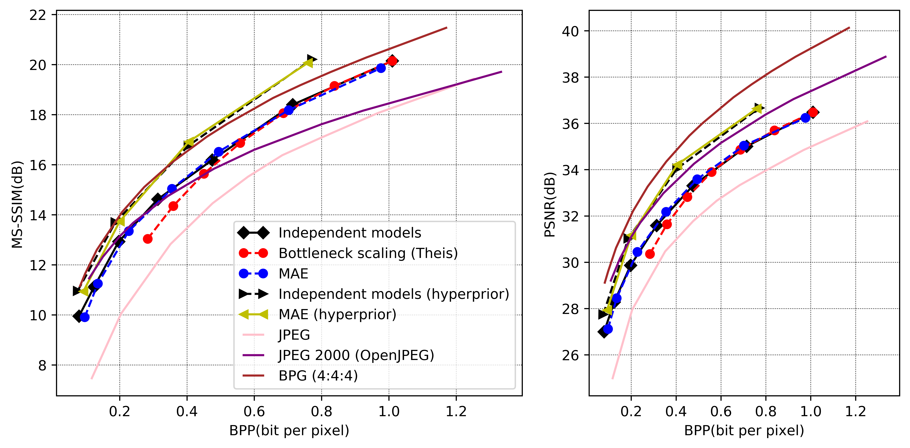

# Variable Rate Deep Image Compression with Modulated Autoencoder 
### [[paper]](https://ieeexplore.ieee.org/document/8977394)

# Abstract: 
Variable rate is a requirement for flexible and adaptable image and video compression. However, deep image compression methods (DIC) are optimized for a single fixed rate-distortion (R-D) tradeoff. While this can be addressed by training multiple models for different tradeoffs, the memory requirements increase proportionally to the number of models. Scaling the bottleneck representation of a shared autoencoder can provide variable rate compression with a single shared autoencoder. However, the R-D performance using this simple mechanism degrades in low bitrates, and also shrinks the effective range of bitrates. To address these limitations, we formulate the problem of variable R-D optimization for DIC, and propose modulated autoencoders (MAEs), where the representations of a shared autoencoder are adapted to the specific R-D tradeoff via a modulation network. Jointly training this modulated autoencoder and the modulation network provides an effective way to navigate the R-D operational curve. Our experiments show that the proposed method can achieve almost the same R-D performance of independent models with significantly fewer parameters.

# Dependences 
- NumPy, SciPy, NVIDIA GPU
- **Data Compression Library:** (https://github.com/tensorflow/compression), thanks to Johannes Ballé, Sung Jin Hwang, and Nick Johnston
- **Dataset:** CLIC or larger high quality dataset

# Installation 
- Install compression library with version 1.1 (https://github.com/tensorflow/compression/releases/tag/v1.1).
(In our paper we use the version 1.1 for our MAE method without hyperprior and version 1.2 with hyperprior.)
 
# Illustration

# Framework 
 

# Results 
 

# Main references 
Our work heavily rely on the following projects: 
- \[1\] 'Lossy Image Compression with Compressive Autoencoders' by Theis et. al, https://arxiv.org/abs/1703.00395
- \[2\] 'End-to-end Optimized Image Compression' by Ballé et. al, https://arxiv.org/abs/1611.01704
- \[3\] 'Variational image compression with a scale hyperprior' by Ballé et. al, https://arxiv.org/abs/1802.01436
 
It would be helpful to understand this project if you are familiar with the above projects.
# Contact

If you run into any problems with this code, please submit a bug report on the Github site of the project. For another inquries pleace contact with me: fyang@cvc.uab.es
